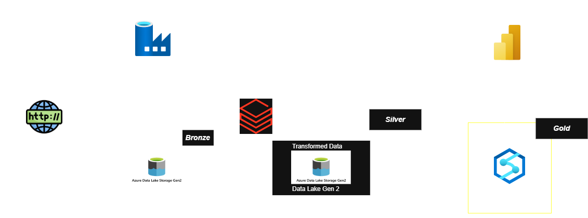

# Azure End-to-End Data Engineering Pipeline

## AdventureWorks Sales Analytics | Microsoft Azure | Medallion Architecture

## Project Overview

This project demonstrates a production-style, end-to-end data engineering pipeline built entirely on Microsoft Azure. Raw sales data is ingested from an HTTP source, transformed through a Bronze → Silver → Gold medallion architecture using Azure Databricks, and served via Azure Synapse Analytics to a Power BI dashboard for business reporting.

### Architecture




| Layer | Service | Description |
|---|---|---|
| **Infrastructure** | Terraform | Provisions all Azure resources as code (IaC) |
| **Ingestion** | Azure Data Factory | Orchestrates HTTP data pull into the data lake |
| **Raw (Bronze)** | Azure Data Lake Gen2 | Stores raw, unprocessed source data |
| **Transform (Silver)** | Azure Databricks | Cleans, joins, and transforms Bronze data |
| **Serve (Gold)** | Azure Synapse Analytics | Exposes curated data via external tables and views |
| **Reporting** | Power BI | Interactive dashboard for sales analytics |

---

## Tech Stack

- **Terraform** — Infrastructure as Code for all Azure resource provisioning
- **Azure Data Factory** — Pipeline orchestration and HTTP ingestion
- **Azure Data Lake Storage Gen2** — Scalable raw and transformed data storage
- **Azure Databricks** — PySpark-based data transformation (Bronze → Silver)
- **Azure Synapse Analytics** — Serverless SQL pool with external tables and views
- **Power BI** — Business intelligence and reporting layer
- **Azure Key Vault** — Secure credential and secret management

---

## Repository Structure

```
├── terraform/                  # Terraform IaC — full Azure infra provisioning
│   ├── main.tf                 # Core resource definitions
│   ├── variables.tf            # Input variables
│   ├── outputs.tf              # Output values
│   └── providers.tf            # Azure provider configuration
├── ADF-Scripts/                # ADF pipeline JSON export
├── Architecture/               # Pipeline architecture diagram
├── Data/                       # Sample source CSV datasets
├── PowerBI/                    # Power BI report (.pbix)
├── Synapse SQL scripts/        # DDL scripts for schema, external tables, and views
└── README.md
```

---

## Infrastructure as Code (Terraform)

All Azure resources in this project are provisioned using Terraform, including:

- **Resource Group** — Logical container for all project resources
- **Azure Data Lake Storage Gen2** — With hierarchical namespace enabled
- **Azure Data Factory** — With linked services and pipeline definitions
- **Azure Databricks Workspace** — For PySpark-based transformations
- **Azure Synapse Analytics Workspace** — Serverless SQL pool for data serving
- **Azure Key Vault** — For secure secret and credential management

### Deploy the Infrastructure

```bash
cd terraform
terraform init
terraform plan
terraform apply
```

> **Note:** Ensure you have the Azure CLI installed and are logged in (`az login`) before running Terraform.

---

## Pipeline Walkthrough

**1. Data Ingestion**
Azure Data Factory pulls AdventureWorks sales data from an HTTP source and lands it in the Bronze layer of ADLS Gen2.

**2. Data Transformation**
An Azure Databricks notebook reads the Bronze data, applies cleaning and transformation logic using PySpark, and writes the output to the Silver layer in Delta format.

**3. Data Serving**
Azure Synapse Analytics (Serverless SQL Pool) creates an external schema, external tables pointing to the Silver layer, and Gold views that aggregate and shape data for reporting.

**4. Reporting**
Power BI connects to Synapse to deliver an interactive sales analytics dashboard for business stakeholders.

---

## Key SQL Artifacts

- `Create Schema.sql` — Sets up the external data source and schema in Synapse
- `Create External Table.sql` — Defines external tables over ADLS Gen2 Delta files
- `Create Views gold.sql` — Gold layer views with business-ready aggregations

---

## Dataset

Source: [AdventureWorks](https://github.com/Microsoft/sql-server-samples/tree/master/samples/databases/adventure-works) — a Microsoft sample OLTP database covering sales, products, customers, and territories.

---

## Skills Demonstrated

- Infrastructure as Code (IaC) using Terraform on Azure
- End-to-end Azure data pipeline design and implementation
- Medallion architecture (Bronze / Silver / Gold) on ADLS Gen2
- ADF pipeline authoring and HTTP connector configuration
- PySpark transformations in Azure Databricks
- Synapse Serverless SQL — external tables, schemas, and views
- Power BI report development connected to Synapse
- Secure secret management with Azure Key Vault

---

## Author

**Bhavith Prabhakar Shetty**
Senior Power BI Developer | Azure Data Engineer
[LinkedIn](https://linkedin.com/in/bhavith22) | [GitHub](https://github.com/bhavith1993)

